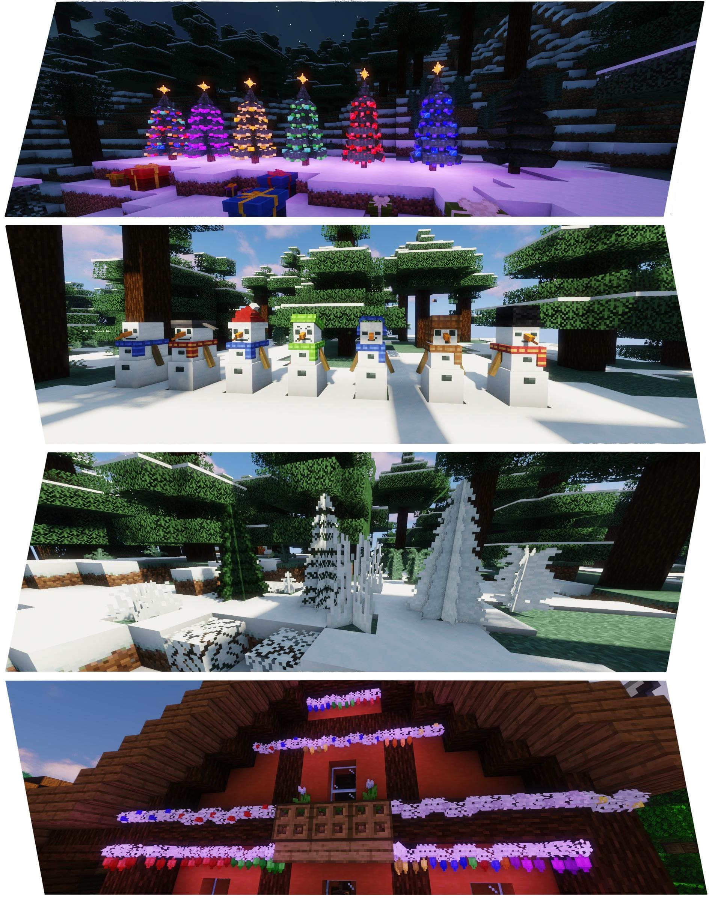
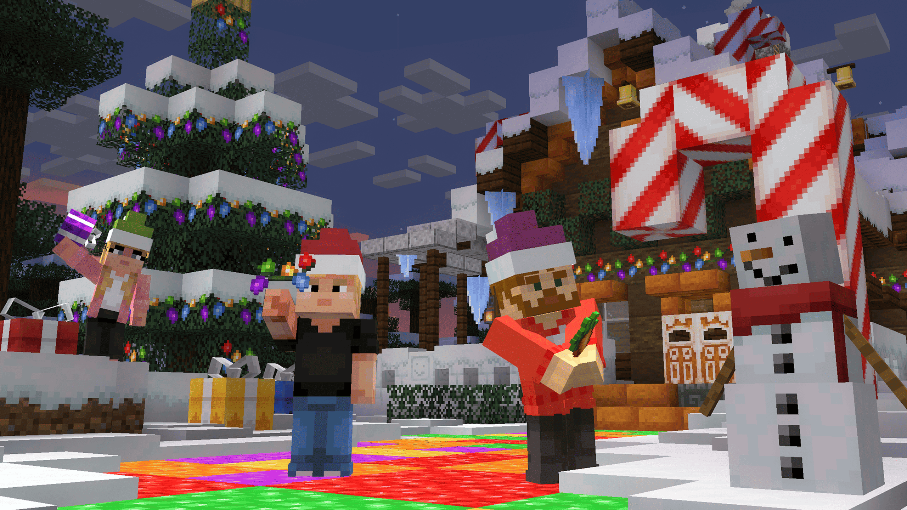
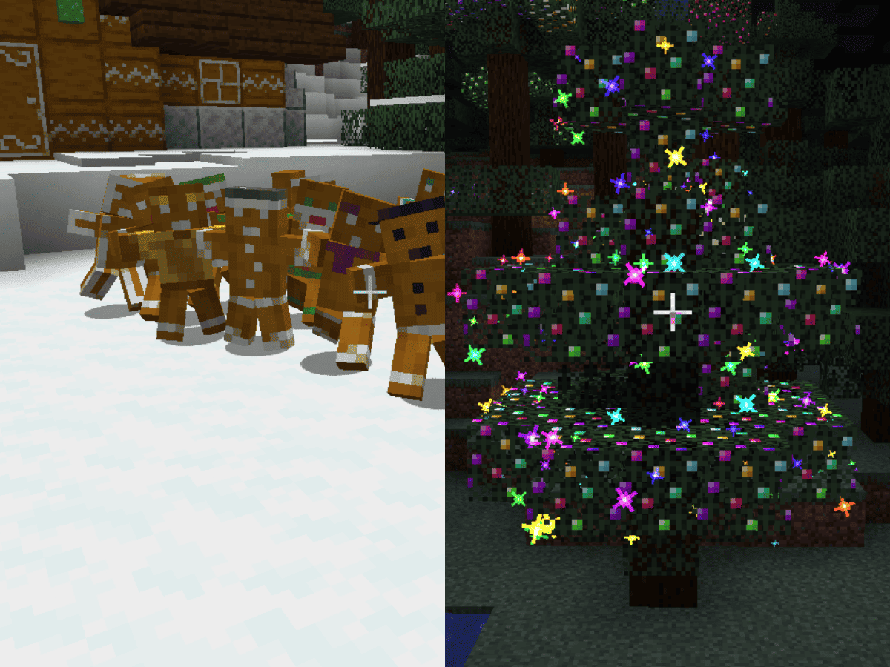
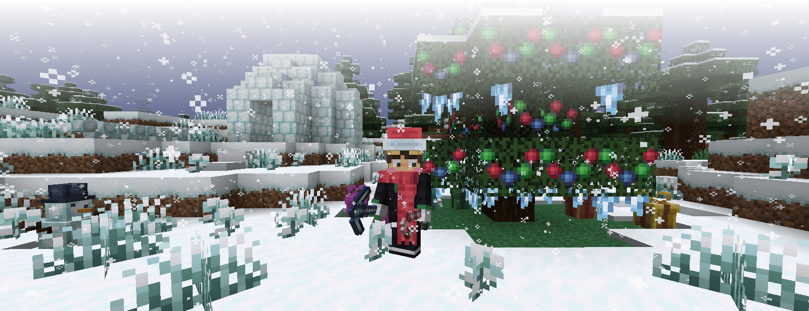
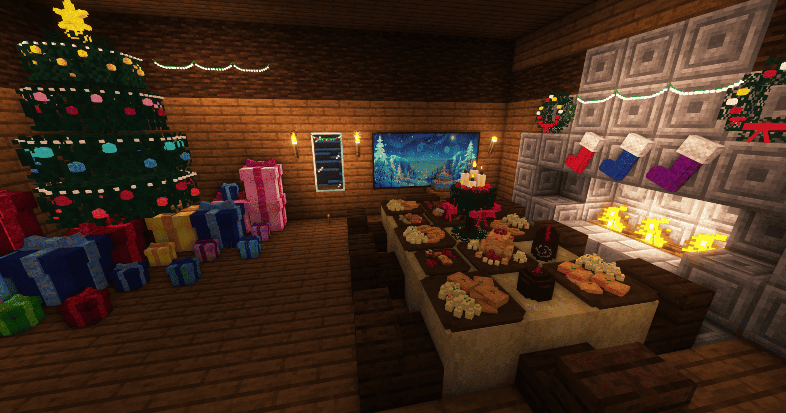
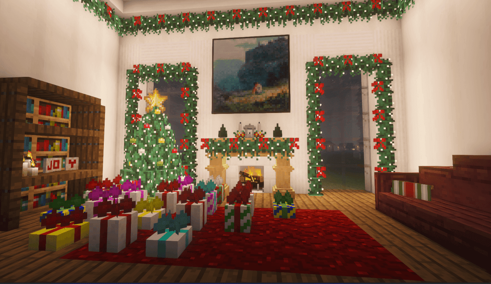
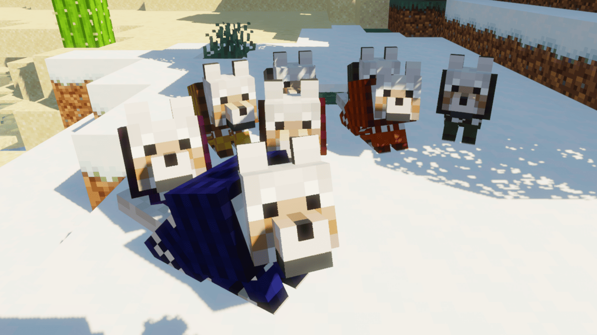

# Akliz's Christmas Mod Picks

You know that first glimpse of a snow-covered roof that suddenly turns your base into a storybook scene? That's the exact little moment holiday mods chase — small, deliberate touches that make builds feel lived-in and seasonal.

These seven picks cover the full cozy toolkit: decorations, wearable cosmetics, edible treats, and playful mechanics (think sleds, gingerbread companions, and interactive trees). Below I’ll explain what each mod does and how to stitch them together so your world or server looks festive for this Christmas.

**Tip:** If you plan to install mods that add many new crafting recipes or foods, we recommend JEI (Just Enough Items) to simplify recipe lookup and event setup.

Whether you're running a private survival realm, a small community, or a larger public server, these mods are chosen to be friendly to cooperative installs. My approach here was practical: pick one or two mods that change gameplay (Seasons Greetings, Snowy Spirit), a couple that add visual variety (Macaw's Holidays, Winterly), and one or two that provide roleplay / event affordances (Christmas Culinary, Maiden's Merry Making). That mix gives you immediate visual payoff without forcing players to relearn core mechanics.

## Macaw's Holidays

Macaw's Holidays is the go-to decoration pack when you want huge variety with zero complexity. It adds 250+ craftable decor pieces — trees, ornaments, stockings, presents, garlands, icicles, sleds, little furniture props and a handful of silly pre-built snowmen — all using simple vanilla-style recipes. Because everything is cosmetic and craftable from common materials, it's server-friendly and safe for survival worlds: no new mechanics to balance, just pure atmosphere.

Why include it first: it fills the visual gaps faster than any single mod. Need a mantel full of stockings? Done. Want dozens of unique present colors to scatter under a tree? Done. The pieces are small and mix-and-matchable, so you can decorate gradually or do a full makeover in an afternoon.

**Versions & Modloaders:** 1.16.5 -> 1.21.10 | Fabric, Forge and NeoForge

### Quick tips
- **Pair** Macaw's with a few gameplay-focused holiday mods (like Seasons Greetings or Snowy Spirit) — Macaw handles the visuals while the others bring mechanics.
- **Use** the garlands and string lights to create natural-looking rooflines; ornaments and color variants keep repeat builds from looking identical.

**Mod page:** [Macaw's Holidays](https://www.curseforge.com/minecraft/mc-mods/macaws-holidays)

*Image pulled from the mod's CurseForge page.*

## Seasons Greetings

Seasons Greetings is the mod that turns holiday decorating into actual gameplay. At its heart are the Gingerbread Men — tiny, tamable companions that can fight, mine, and assist with chores — and a massively customizable Snow Golem system that makes every snowy sentinel unique. Beyond the mobs, Seasons Greetings adds craftable gingerbread architecture, wreaths and modular gift boxes, cozy warm drinks, and building blocks like peppermint bricks and icing-trimmed shingles so your builds read as proper holiday structures rather than just “festive-colored.”

Why this one matters: it blends mechanics and charm. Want players to actually care about the season? Let them recruit gingerbread allies, hunt for special food recipes, or craft secret gift boxes that hide surprises from each other during server events. The Cozy status effects from hot cocoa and warm milk are small but impactful for winter survival, and gift boxes plus dyeable bows make Secret Santa events feel easy to run.

### Quick tips
- **Use** gingerbread companions during server events — they're resilient and adorable; keep a stack of gingerbread crumbs for revival.
- **For builders**, the peppermint blocks and 4-layer icing system create readable, themed roofs and facades without heavy resource costs.

**Versions & Modloaders:** 1.21.1 | Fabric and NeoForge

**Mod page:** [Seasons Greetings](https://www.curseforge.com/minecraft/mc-mods/seasons-greetings)

*Image pulled from the mod's CurseForge page.*

## Snowy Spirit

Snowy Spirit focuses on winter immersion with functional toys like sleds, gingerbread golems, villager winter behaviors, and ambiance blocks that make cold biomes feel alive. The sled mechanics are surprisingly deep — chest-compatible sleds that accelerate downhill and can be pulled by tamed wolves — while gingerbread golems add cute, repairable companions and naturally spawn in gingerbread houses found in snowy structures.

**Versions & Modloaders:** 1.18 -> 1.21.1 | Fabric, Forge and NeoForge

### Quick tips
- **Put sled courses** on hill biomes for player events; attach chests to make traveling loot runs fun.
- **Gingerbread golems** are fragile in water; keep them on packed-snow paths and carry repair cookies.
- **Configure** the winter-event timing if you run Serene Seasons or other seasonal mods so villagers and structures sync up.

**Mod page:** [Snowy Spirit](https://www.curseforge.com/minecraft/mc-mods/snowy-spirit)

*Image pulled from the mod's CurseForge page.*

## Winterly

Winterly is a lightweight, cosmetics-first holiday mod that focuses on wearables and easy decorations: Santa hats, scarves, snow bricks, icicle props and small functional presents that suit community servers and roleplay builds. It doesn't introduce heavy mechanics — just low-effort, high-charm additions that make bases feel seasonal.

**Versions & Modloaders:** 1.18 -> 1.21.1 | Quilt, Fabric and NeoForge

### Quick tips
- **Use** the hats and scarves to mark event staff or holiday NPCs; they're cosmetic only.
- **Place** icicles on rooflines and use dense-snow blocks for textured builds; cryo-marble tools are great for themed screenshots.
- **Gift boxes** double as small storage for Secret Santa events; color-code them for teams.

**Mod page:** [Winterly](https://www.curseforge.com/minecraft/mc-mods/winterly)

*Image pulled from the mod's CurseForge page.*

## Christmas Culinary Desires & Decorations

If you want a world that *tastes* like the holidays, Christmas Culinary Desires & Decorations is the go-to. This mod brings placeable, displayable holiday dishes from around the world — panettone, roast goose, dumplings, festive cakes, puddings and more — plus matching props (tablescapes, plates, multi-part trees and functional gift boxes). Everything is crafted with vanilla-friendly recipes so it's perfect for roleplay servers, community feasts, and immersive builds where food tells part of the story.

Why include it: food is a simple, powerful immersion tool. A bakery lined with panettone, a tavern serving eggnog with the Cozy effect, or a market stall of regional dishes immediately sells the setting. The mod also pairs nicely with decorative packs: place a multi-section tree behind a bakery counter, scatter presents, and set up a hot drinks station to encourage player gatherings.

**Versions & Modloaders:** 1.16.5 -> 1.21.10 | Fabric, Forge and NeoForge

### Quick tips
- **Use** placeable dishes as event props — they look great on tables and don't require complex setup.
- **For roleplay servers**, assign dishes to vendors or use dyeable gift boxes for team-based Secret Santa games.

**Mod page:** [Christmas Culinary Desires & Decorations](https://www.curseforge.com/minecraft/mc-mods/christmas-culinary-desires-decorations)

*Image pulled from the mod's CurseForge page.*

## Maiden's Merry Making

Maiden's Merry Making is the big, immersive holiday pack for servers that want interactive decorations and full festive systems. Think clickable multi-section trees, connectable light strings, decorated mantels with placeable stockings, lamp posts with wreaths, and wearable ugly-sweater armor that scales from leather to netherite. It's the kind of mod you use when you want community events to feel polished: tree-decorating contests, town-wide light shows, and mantelpiece Secret Santa reveal moments.

Why include it: Maiden's ties decoration to interaction — lights connect around corners, garlands attach to fences, and trees accept ornaments and garlands piece-by-piece. That interactivity makes simple builds feel handcrafted and gives players something to *do* during holidays beyond placing blocks.

**Versions & Modloaders:** 1.14.4 -> 1.21.4 | Forge and NeoForge

### Quick tips
- **Use** the 3-section customizable trees during community builds so different players can own a section and decorate it collaboratively.
- **Place** fireplace mantels in inns and meeting halls; they make great photo spots for events and accept stockings and small decor.

**Mod page:** [Maiden's Merry Making](https://www.curseforge.com/minecraft/mc-mods/maidens-merry-making)

*Image pulled from the mod's CurseForge page.*

## Dog Coats (Resource Pack)

Tiny but delightful: Dog Coats is a texture pack that dresses tamed wolves in festive sweaters you can dye. No mods required — just install the resource pack on the server or client and enjoy instantly cozier pets.

**Versions & Modloaders:** Resource pack | client-side only

### Quick tips
- **Dye wolves** by shift-right-clicking with standard dyes to color their sweaters; match team colors for events.
- **No performance impact** — safe for public servers and lobby displays.
- **Works great** alongside Maiden's Merry Making and Macaw's Holidays for cute, photo-ready scenes.

**Pack page:** [Dog Coats](https://www.curseforge.com/minecraft/texture-packs/dog-coats)

*Image pulled from the pack's CurseForge page.*

Installation note: since it's client-side, remind players to add the pack before joining or provide a download link on your server's welcome page. It works alongside texture-changing mods but requires no code; for public servers, include a server-side reminder about the recommended pack to ensure everyone sees the same cozy wolves.

## Wrapping It Up

So there you have it — seven ways to turn your Minecraft Christmas into something actually *special*. Whether you're going full gingerbread-golem army mode with Seasons Greetings, building an immersive holiday bakery with Christmas Culinary, or just slapping some dog sweaters on your wolves for maximum cozy chaos, there's something here for every festive build.

The best part? All these mods play nicely together. Load them all up, and your server won't just feel seasonally decorated — it'll feel like it's actively *celebrating* with you. That's the real Christmas magic.

Anyway, that's what's keeping my pickaxe swinging this winter. Now if you'll excuse me, I have some gingerbread men to recruit and some hot cocoa (with Cozy effect) to sip while I admire my snow golem army. See you in the snowy dimension!

## So Where Do You Go After This?

All of these mods are available on **CurseForge** — create a NeoForge profile for Minecraft 1.21.1 and install them together in a single modpack.

Want to try these out on a server with friends without the usual setup stress? Hosting a seasonal server is easier than ever — **Akliz** offers quick installs and solid support so you can get your friends together and start decorating in minutes. 
Ready to jolly everything up? [Start your Akliz server today!](https://www.akliz.net/pricing)