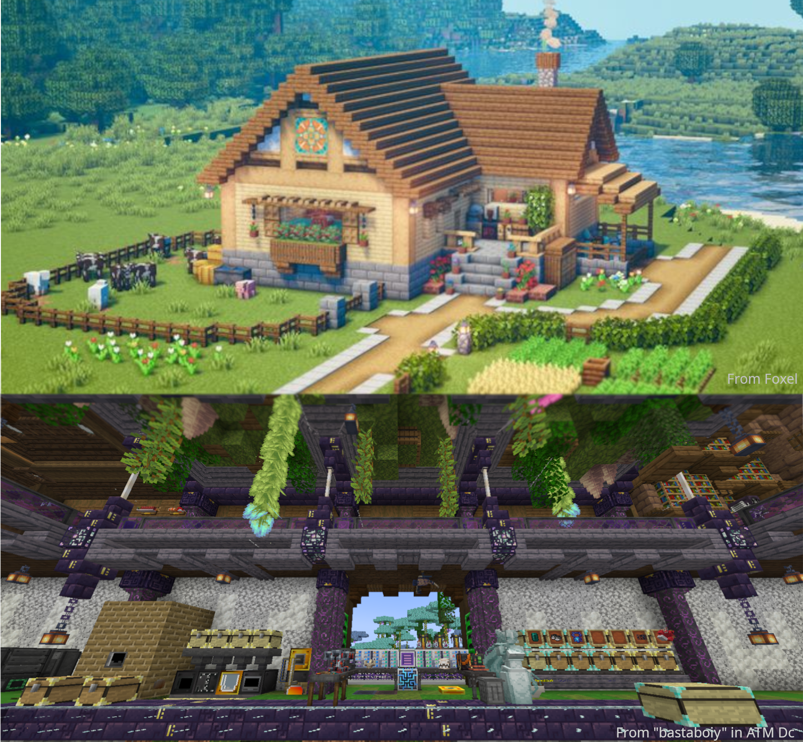
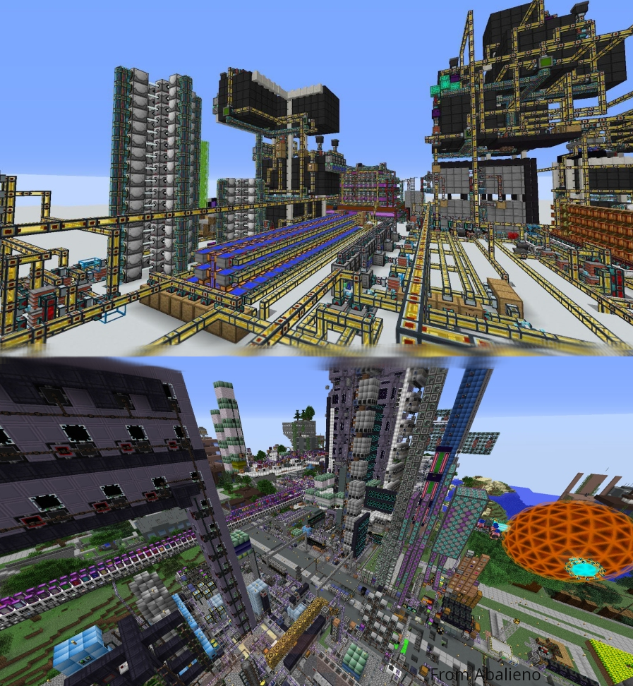
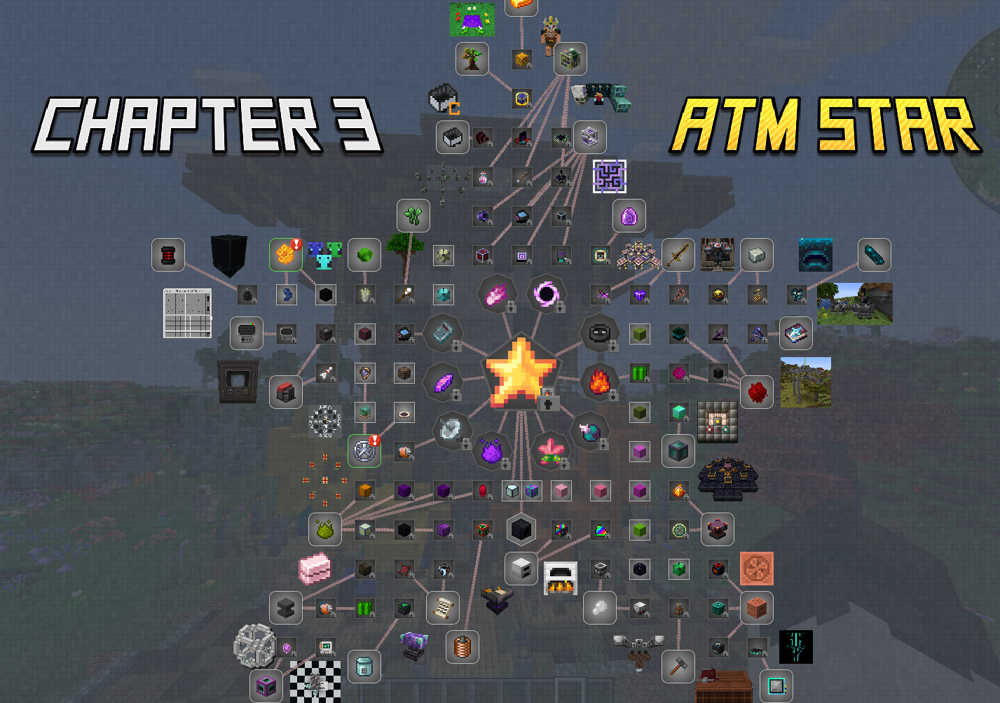
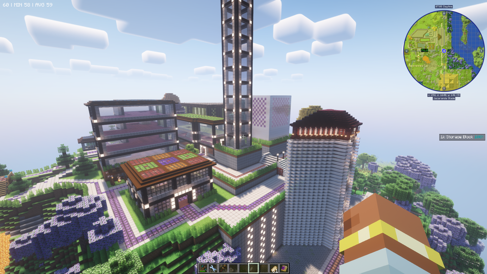
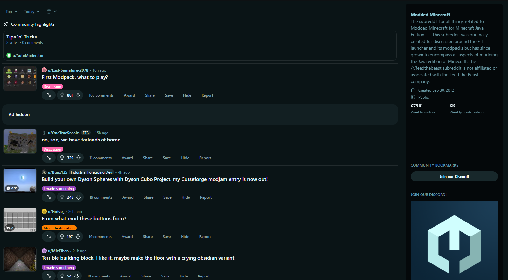
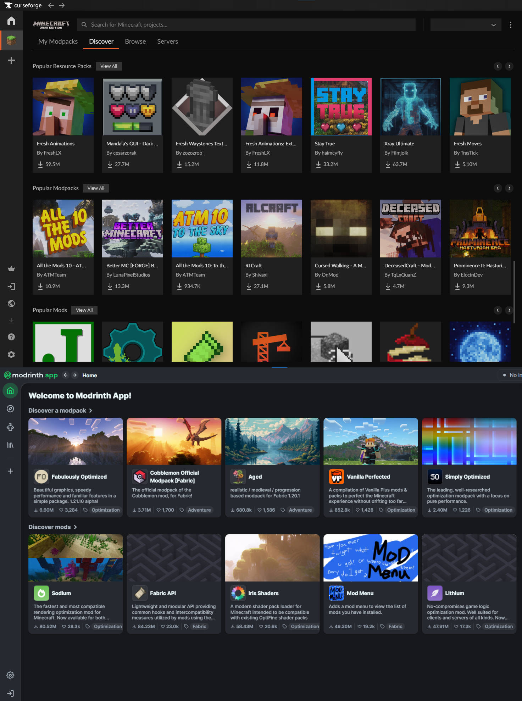

# Why Modded Minecraft Is Still Thriving in 2025

You know that moment when you load into a fresh modpack and instantly feel overwhelmed by 300+ mods, a quest book thicker than an encyclopedia, and more ore types than you can count? Yeah, that's modded Minecraft in 2025, and somehow, it's more alive than ever.

Minecraft itself just turned 16 years old. That's ancient in gaming years; most games from 2009 are collecting dust in our digital libraries. Yet here we are, with modded Minecraft pulling in millions of players, spawning new packs every week, and showing absolutely no signs of slowing down. So what's keeping this giant alive? Let's dig into why modded Minecraft isn't just surviving, it's absolutely thriving.

## The Content Gap That Vanilla Can't Fill

Don't get me wrong, vanilla Minecraft is fantastic. Mojang has done an incredible job with updates like the Tricky Trials and the recent Copper Age additions. But let's be real: vanilla updates once or twice a year, adding a handful of new features each time. Meanwhile, the modded community is pumping out content at warp speed.

Here is a quick comparison between an early-game Vanilla base VS what would be considered an early-game base in Modded.

We see some magic stuff, storage systems, and what looks like industrial-scale smelting?
Yeah...

Or if this didn't convince you and you are one of those players who wants to go beyond, here is a base of a more challenging modpack like **GregTech: New Horizons**.

Ah, yes, the smell of Polybenzimidazole.

Want to build a nuclear reactor that powers your entire base? There's **Mekanism**. Craving a brutal survival experience where every night is a nightmare? **RLCraft** has your back. Missing Pokémon in your blocky world? **Cobblemon** literally recreated the entire Pokémon experience in Minecraft. The modded scene fills every possible gap that vanilla leaves open, and then creates gaps you didn't even know existed.

For many players, modded Minecraft has become the "real" endgame. Once you've defeated the Ender Dragon for the hundredth time, what else is there to do? Modpacks give you progression systems that can last hundreds of hours. **GregTech: New Horizons**, for instance, is designed to take over 2,000 hours to complete. That's not a typo, two thousand hours of carefully structured, interconnected progression that makes vanilla's few dozen hours of content look like a tutorial.

## Innovation Through Modpacks

The beauty of modded Minecraft in 2025 isn't just about individual mods anymore; it's about how modpacks mash them together into completely new experiences. The modpack scene has evolved into an art form.

Take kitchen-sink packs like **All the Mods 10** or **Enigmatica 10**. A kitchen-sink pack is a modpack featuring many mods mashed together, aiming to let you play however you want. These aren't just "throw 400 mods in and hope for the best" situations anymore. Modern kitchen-sink packs have sophisticated integration systems, unified ore generation, and carefully balanced progression. You can jump between **Modern Industrialization**'s advanced tech and **Ars Nouveau**'s spell crafting without feeling like you're playing two separate games.

Let me introduce you to the **ATM Star**, the main objective of the **AllTheMods** series packs. It's the pinnacle of interconnection between mods, because crafting it forces you to dive into every major system the modpack offers. Instead of sticking to one progression path, you're pushed to explore tech, magic, automation, resource generation, and late-game bosses from multiple mods. Every component requires mastering different mechanics, making the ATM Star not just an end-goal item but a celebration of the entire modpack's mod synergy.

(There is a **lot** more packs that also feature similar progression, this is just a popular example)

Then you've got expert packs, and oh boy, these are where the real masochists hang out. Packs like **Enigmatica 2: Expert** or **Divine Journey 2** completely rewrite the rules. Suddenly, that simple iron pickaxe requires a multi-stage processing system involving 10 different machines and power generation. It sounds insane, and it is, but there's something deeply satisfying about finally crafting that one item you've been working towards for 20 hours (and then you realize that's just the start).

**FTB Quests** and similar quest systems have also revolutionized how new players experience modded Minecraft. Remember when learning a new modpack meant alt-tabbing to wiki pages every five minutes, or flipping through those cryptic mod books? Now you've got in-game guides, rewards, and clear progression paths. These mods made modded Minecraft more accessible than ever before.

And let's not forget skyblock packs. You'd think the concept would get old, right? Start on a floating island, expand, automate, repeat. But nope, the community keeps finding ways to make it fresh. We've gone from the original **SkyFactory** to **Project Ozone** to modern interpretations that add RPG elements, custom dimensions, and progression systems that would make a vanilla player's head spin.

## Multiplayer: Where Modded Really Shines

Playing modded Minecraft solo is fun, but multiplayer? That's where the magic happens. There's something special about building a massive automated factory with friends, dividing tasks, and watching your collective base grow from a dirt hut to a sprawling industrial complex, be it underground, on the surface... or even on a space station.

Modern modded servers have gotten incredibly sophisticated. Performance optimization mods like **Spark** and **Observable** let server admins track down lag sources and keep things running smooth even with 20+ players online. Mods like **FTB Chunks** let you claim and protect your builds, while **FTB Teams** makes collaboration seamless: you can share resources and grant base access to other people, while still having the protection of **FTB Chunks**.

Server hosting has also become ridiculously easy. Five years ago, setting up a modded server meant wrestling with Java arguments, manually uploading mods, and praying everything worked. Now? One-click installations, automatic updates, and enough RAM allocation options to run even the heaviest modpacks. Companies like **Akliz** have made it so simple that even technical novices can get a server running in minutes.

The collaborative aspect of modded SMPs creates stories that just don't happen in vanilla. Someone sets up a massive **Mekanism** power grid. Another player establishes a **Botania**-based trading hub. A third goes full wizard with **Ars Nouveau** and offers enchanting services. Before you know it, you've got an actual functioning economy and community, all built around these incredible mod systems.

## The Community That Never Quits

Here's the thing about the modded Minecraft community: they're absolutely relentless in the best possible way. Thousands of creators are constantly pushing out new mods, updating old favorites, writing comprehensive guides, and building wikis that put some official game documentation to shame.

YouTube and Twitch keep modpacks alive long after their initial release. When a creator starts a new series on a modpack, boom, suddenly thousands of new players are downloading it and jumping in. The community feedback loop is insane: players find interesting interactions, share them on Reddit, mod developers see the discussions and get inspired to create new content, which then gets showcased by content creators, which brings in more players. It's a perpetual motion machine of creativity.

The "culture" of modded Minecraft is also worth mentioning. There's this shared experience of downloading a pack, being completely lost for the first hour, gradually figuring things out, and then eventually becoming the person answering questions for the next wave of new players (I started exactly like that, and now I'm the one writing guides). People don't just play a modpack and move on; they become part of its community, contribute to its wiki, share their builds, and eagerly wait for the next big release.

## The Ecosystem That Supports It All

Behind every great modded experience is an infrastructure that's gotten incredibly robust. **CurseForge** remains the undisputed king of mod hosting, with an absolutely massive library and an ecosystem that just works. The CurseForge launcher makes installing and updating modpacks so easy that my grandma could probably do it (okay, maybe not my grandma, but you get the point).

**Modrinth** has also emerged as a serious competitor, and competition is great for players. Modrinth's lightweight approach, open-source philosophy, and clean interface have won over a significant chunk of the community. Some mod developers now exclusively use Modrinth, while others publish on both platforms. This competition drives innovation and keeps both platforms constantly improving.

The tooling around modded Minecraft has also matured significantly. **JEI** (Just Enough Items) is basically mandatory now, imagine trying to learn 400 mods without a recipe viewer. Performance mods like **Sodium**, **Lithium**, and **FerriteCore** can literally double or triple your FPS. **Patchouli**, the in-game documentation mod, lets mod authors create beautiful, interactive guidebooks that make learning complex systems actually enjoyable.

Even mod development tools have improved. **NeoForge** emerged as a modern successor to **Forge**, bringing better performance and cleaner code. **Fabric** continues to attract developers who want a lightweight, flexible platform. This diversity in mod loaders means more choice for players and more innovation in the modding scene.

## Why It All Matters in 2025

So here we are in 2025, and modded Minecraft isn't just alive, it's thriving in ways that would have seemed impossible a decade ago. The community has professionalized without losing its passion. The technical infrastructure has matured while staying accessible. The content keeps flowing at a pace that's honestly kind of ridiculous.

Modded Minecraft has become more than just "vanilla with extra features." It's a living, breathing ecosystem where creativity compounds on itself. A mod developer makes something cool, a modpack maker integrates it in an interesting way, a server admin builds a community around it, content creators showcase it, and players push it to its limits and share what they discover.

The secret to modded Minecraft's longevity isn't complicated: as long as players dream bigger than what vanilla offers, modded Minecraft will have a place. Judging by the sheer ambition of projects like **GregTech: New Horizons**, the constant innovation in packs like **All the Mods**, and the endless creativity in mods like **Create**, those dreams aren't getting any smaller.

Want to experience it for yourself? Grab some friends (or just join in a community server) and pick a modpack that looks interesting (my current recommendation is **All the Mods 10** for players who like to have freedom, while still having a objective or one of the OG's, **SevTech: Ages**, a progression pack that takes you from the Stone Age to Space), and jump in. Setting up a server is easier than ever; you can have one running in literally minutes with the right hosting.

The modded Minecraft train isn't stopping anytime soon, and honestly? That's exactly how it should be. As long as there are blocks to place and mods to create, this community will keep building, automating, exploring, and pushing the boundaries of what's possible in a 16-year-old game about mining and crafting.

## So Where Do You Start?

If you're itching to bring your wildest modpack dreams to life, or just want a lag-free place to mine, craft, explore (and build nuclear reactors) with friends, there's really no better time to launch a server. With **Akliz**, setting up a high-powered modded Minecraft world is effortless: one-click installs, robust hardware, and support that understands exactly what "crash log at 2 AM" means. Ready to turn your next adventure up to eleven? [Start your Akliz server today.](https://www.akliz.net/pricing)

**Anyway, that's what's keeping my pickaxe swinging in 2025. See you in the modded dimension!**
