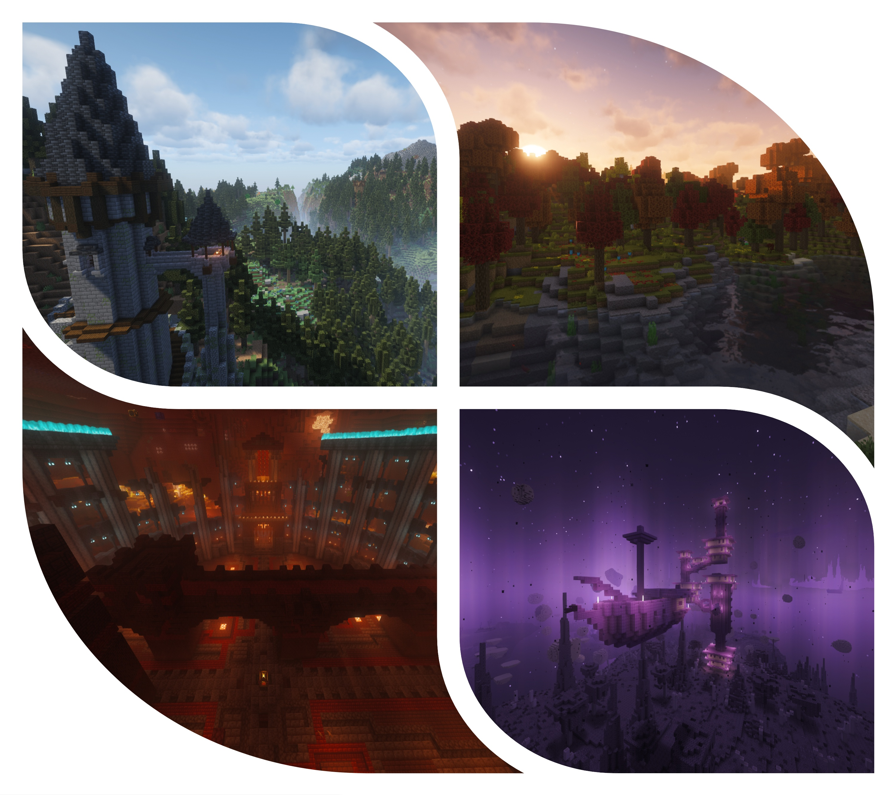
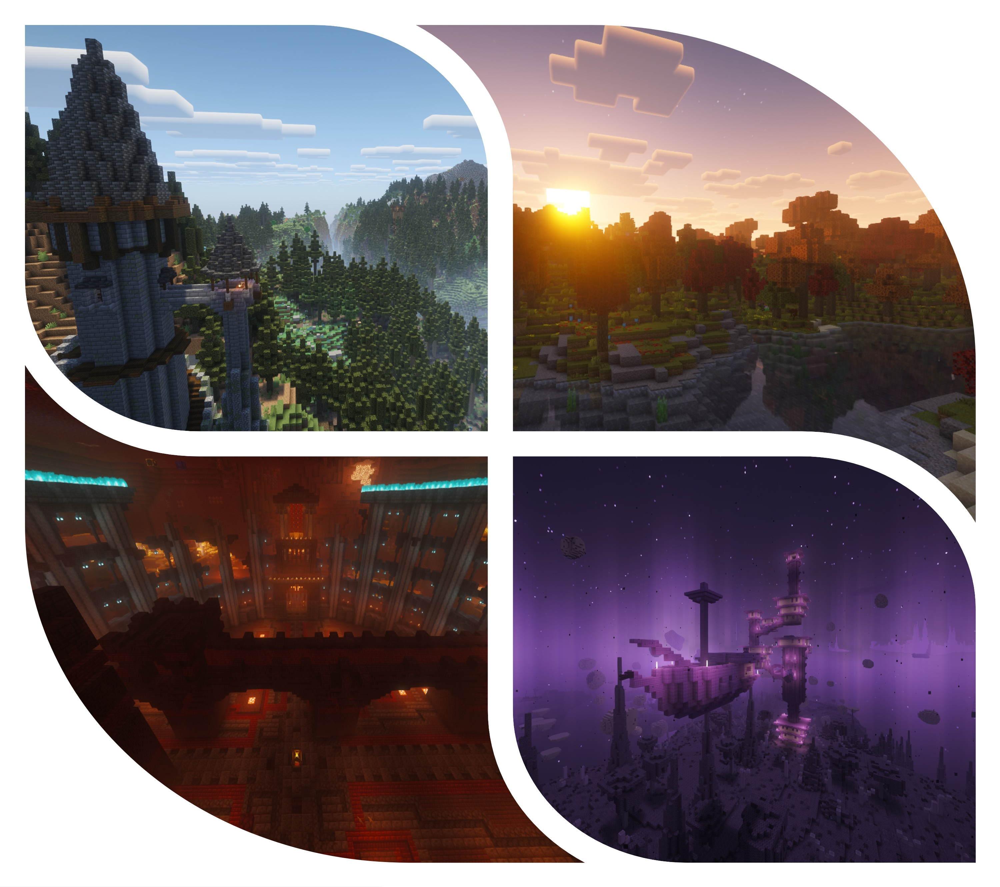
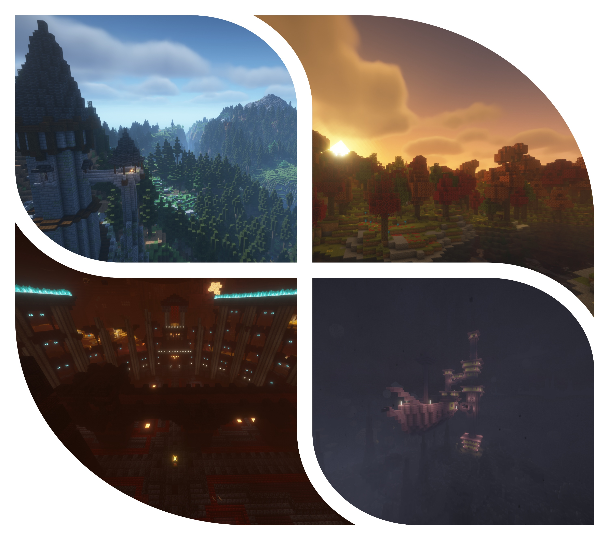
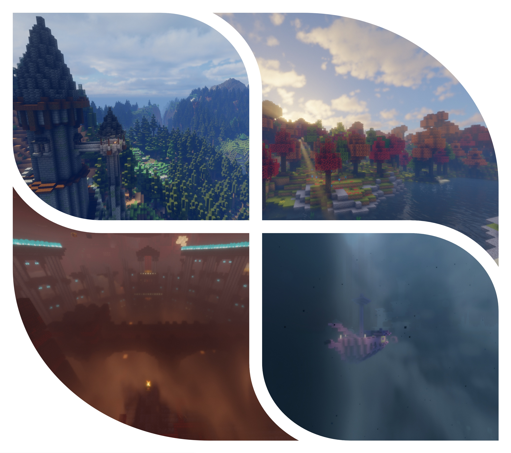
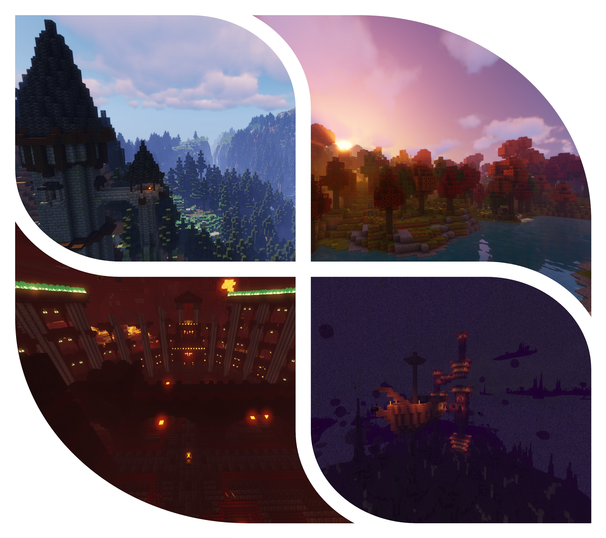
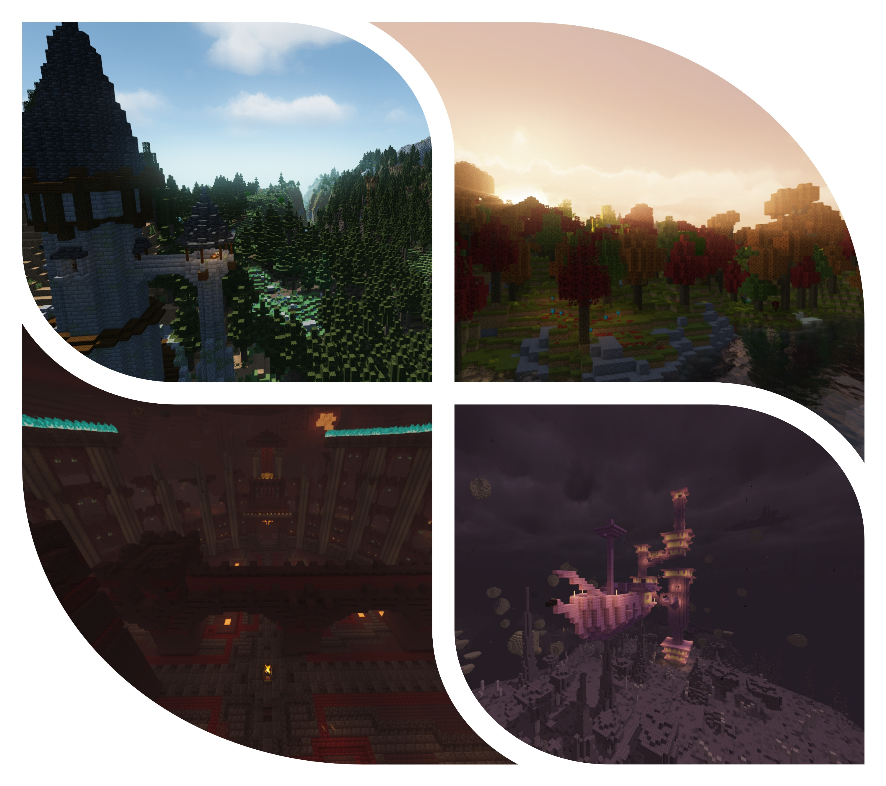

# Top 5 Shader Packs To Use In Your Modpack

Imagine you just spent the whole weekend building a huge factory or a floating wizard tower in a Modpack. You step back to look at it, and it looks... flat. The blocks are there, the design is cool, but the lighting isn't doing it any justice.

Then you watch a creator on YouTube playing the same pack as you, and their world looks so much better. You see light rays going through the trees, water reflecting the sky like a mirror, and the shadows actually have depth, not the usual blocky vanilla shadows. Suddenly their build looks like a game trailer, and your world looks like a screenshot from a different game.

**What do they have that you don't? You aren't missing a mod, you are missing Shaders.**

## What Are Shaders?
Before you jump into using Shaders, I want to explain what they are.

In vanilla Minecraft, light is like a spreadsheet. Put a torch down and that block gets light level 14, next block drops to 13, and the game paints the world with that number grid. It's simple, it works, and... it is not pretty.

Shaders improve that by letting your GPU handle the visual work, but it can't do it by itself. First you need a rendering mod (which I'll talk about in a second) to replace the vanilla graphics engine with its own, and then it hands the control to the Shader. The Shader then implements its own system, adding features like real-time shadows, reflections, bloom, and more.

This is especially powerful in Modded Minecraft. Big build projects with animated blocks, machines with light effects, and custom terrain all get a huge visual upgrade when Shaders are layered over them.

## How Shaders Were Used Back In The Day

There was a time when Shaders meant one thing: OptiFine. It was the go-to mod for using Shaders and... well... the only mod that did it. But it also had a rough reputation for compatibility issues, especially with other mods.

OptiFine wasn't just about Shaders though; it also packed optimizations and more graphics options. For a while, it was the one mod people installed when they wanted both good graphics and a smoother game. 

But installing the Shaders themselves often felt like a gamble. You could spend an hour trying to get it to stop crashing or just get stuck dealing with weird issues. That time was the Dark Ages for people who just wanted their world to look better.

Nowadays, we have a better setup. Modern rendering mods let you run Shaders more reliably than ever. They work with a wide range of mods, they boost your performance, and they make the whole process much more straightforward.

### The Mods That Make It Happen 

OptiFine was the original, but time didn't go easy on it. The new generation of high-performance and Shader-friendly mods is what matters for Modded Minecraft today. Note that there are way more mods like these; I just picked the most popular and stable ones.

- **[Sodium](https://www.curseforge.com/minecraft/mc-mods/sodium)** (Fabric and NeoForge) and **[Embeddium](https://www.curseforge.com/minecraft/mc-mods/embeddium)** (Forge): Performance-focused rendering improvements. They make Minecraft feel smoother before Shaders even start.
- **[Iris](https://www.curseforge.com/minecraft/mc-mods/irisshaders)** (Fabric and NeoForge) and **[Oculus](https://www.curseforge.com/minecraft/mc-mods/oculus)** (Forge): The modern Shader loaders. They act like a bridge between the game and the Shader Packs.

That means you can run massive Modpacks with beautiful graphics without your game turning into a slideshow and your computer cosplaying as an expensive space heater.

## Pros And Cons In Modded Minecraft

Shaders are awesome, but they come with tradeoffs. Here's the quick version:

- Pro: Builds look amazing. Your base goes from meh to cinematic.
- Pro: Water, shadows, and skies look amazing.
- Pro: Even simple scenes look richer and more immersive.
- Con: Shaders can be hard on your GPU.
- Con: Not every Shader Pack plays nicely with every mod.
- Con: You may need to tweak settings to balance visuals and performance.

The good news is that modern Shader Packs are better optimized than ever. Not only that, but there are some that are more focused on being lightweight, meaning even the weakest computers could get a major visual overhaul. And if your build is on a server? Let the server handle the world logic, and let your GPU handle the view.

On top of that, the great majority of Shader Packs come with different presets, so you can choose what level of quality you want, without having to spend an hour looking up settings and manually adjusting values.

With that out of the way, this is probably the part you are here for.

## Top 5 Shader Packs

These are the Shader Packs I hand-picked for this article. These are not ranked by simply "the best", but by things like: what they offer, compatibility with mods, performance, and legacy. Pick what you feel is best for your case, or try them all!

### 1. **[Complementary Unbound](https://www.curseforge.com/minecraft/shaders/complementary-unbound) / [Complementary Reimagined](https://www.curseforge.com/minecraft/shaders/complementary-reimagined)**
  
  Kicking off with the go-to Shaders of the modern days, the Complementary Shaders started as an edit of BSL Shaders in 2018, but have since then had a complete rewrite, and followed their own path.

  Complementary focuses on everything that you would want in a Shader Pack:
  - High attention to detail;
  - Tons of customizability;
  - Top tier optimization. 
  

  **There is also another reason for the top spot: same engine, two different styles.** 
  - **Reimagined** reimagines Minecraft while keeping its uniqueness, so you get that Shader feel without losing the game's essence.
  - **Unbound** is smoother and more realistic, giving you improved textures and effects.

  
  

- **Left: Unbound**
- **Right: Reimagined**

### 2. **[BSL Shaders](https://www.curseforge.com/minecraft/shaders/bsl-shaders)**

   BSL Shaders is a timeless classic; it first debuted around 2015, in the 1.8 era. It has been actively maintained and developed through the years, and still is today. BSL is the father to tons of modern Shader Packs, for example: Complementary Shaders (the one I already talked about earlier), Solas, Insanity, and AstraLex.
   
   The objective of this Shader Pack is simple: make Minecraft look modern and beautiful without forcing players into a heavy or realistic style. 

   What you can expect from this:
   - A reliable and balanced classic with a crisp, polished look;
   - Great mid-range performance;
   - Amazing support for all kinds of resource/texture packs.

   

### 3. **[Bliss Shaders](https://www.curseforge.com/minecraft/shaders/bliss-shader)**

   Bliss Shaders started as an edit to `chocapic13`'s Shaders, by a dev that didn't know what they were doing, but they had two objectives: bring out their own vision, and learn how to make Shaders along the way.
   
   Nowadays, it's one of the most used Shaders by players looking for a cinematic and clean feel!

   Here are some of its strong points:
   - Focus on atmosphere and clean realistic lighting;
   - Flexible controls;
   - Each Biome has its own mood and effects.

   

### 4. **[Sildur's Vibrant Shaders](https://www.curseforge.com/minecraft/shaders/sildurs-vibrant-shaders)**

   Yet another classic, Sildur's Shaders date back as far as 2012, having versions from 1.7.10 up to the current version.
   
   The objective of this Shader Pack since its creation is to offer unmatched **universal accessibility**, so much so that even the historically weak integrated Intel graphics or Mac computers can run it without issues, while still offering high-end visual effects and lighting.

   Instead of going for the realistic style as most packs do, Sildur decided to go for his own style, so you can expect rich and vibrant colors focusing on a more cinematic and cozy look.

   What you'll experience with this Shader Pack:
   - Very high compatibility and performance with any kind of hardware or system;
   - A cozy and vibrant world;
   - Prominent compatibility with mods like Distant Horizons.
  
   

### 5. **[MakeUp - Ultra Fast](https://www.curseforge.com/minecraft/shaders/makeup-ultra-fast-shader)**
   
   Last but not least, MakeUp - Ultra Fast, the Shader Pack with a completely different vision from the rest: modular design.

   This Shader is built with the sole purpose of giving full control to the player to design their own Shaders, meaning every single option doesn't just go from Low to High, but can also be toggled off (something that a lot of Shaders don't support). 
   Every feature being optional allows you to fully adapt the Shader to your computer, which does wonders for low-end systems.

   It features fully modular design, swappable color schemes, advanced features for high-end rigs, and it's tested for high compatibility across various environments, even mobile environments via emulators!
   
   What makes this one different:
   - Shaders that adapt to your PC, instead of the other way around;
   - Fully modular and customizable with tons of options and features;
   - Great for players who want subtle improvements without turning their PC into a room heater.
   

## How To Use Them

Okay, I have given you a lot of information, but I didn't tell you the most critical information: how to actually get Shaders running. Now is the time we grab the mods I talked about earlier, and do something with them.

If you're running a Modpack, there are two combos that cover pretty much all cases.

**For Fabric or NeoForge Modpacks:**
- `Sodium` ⇾ The graphics "engine" to replace the basic vanilla one.
- `Iris` ⇾ Your Shader manager and loader.
  
**For Forge Modpacks:**
- `Embeddium` ⇾ The same as above, but built for Forge.
- `Oculus` ⇾ A fork of Iris to Forge.

And to top it off, of course, a compatible Shader Pack, like one of the options I talked about earlier.
  
> Note: Always check if the Modpack you are running doesn't already have these or similar mods included, to avoid conflicts.

Make sure to check out the Shaders settings; most Shaders have at least a basic set of configurations for you to tweak as you like it, or to improve performance.
Some Shaders like the Complementary series also have profiles you can choose: from Potato, if you just want the basic stuff or want to keep your computer from blowing up; all the way up to the Ultra profile, which will give you **the** definitive high-quality visuals you deserve ("I paid for the whole PC, I'm gonna use the *whole* PC" type stuff).

## But Why Is a Server Host Saying All Of This?

Well, for starters, if you are a Modded Minecraft player, you know how heavy Modpacks are. That's what server hosts are here for.
When you play in single-player, you are hosting an internal server on your own PC, which has to handle *everything* from chunk loading, automation, mob ticking, and all the logic going in the background.

With that much load going on, the things that actually impact your experience, like Shaders, will be dealt the short end of the stick.

### Where Does Akliz Come In

With a server, you don't have to worry about *any* of that because it handles the heavy background stuff, so your PC can fully focus on giving you a good experience, with stable FPS and beautiful graphics.

Furthermore, **Akliz** does all the technical stuff for you: gone are the days you need to juggle around Java versions, run install scripts, and manually back up stuff.
And if you plan on playing with your friends, even better! With a couple of clicks, you can easily start up a server on any Minecraft or Modpack version, and be playing in no time.

With the best server-grade hardware, automatic off-site backups (so even if something happens on Akliz's end, your world will be secure), and an expert team, your experience is guaranteed to be amazing.
They have been doing this for **20 years** already. And since they are players themselves, they know exactly what's up, and will get down to fixing your server if stuff goes wrong.

All this to say: Let **Akliz** handle the heavy and technical stuff, so you can just focus on taking screenshots of your world and doing whatever you want, without worrying about lag.

[Start your **Akliz** server today and elevate your experience!](https://www.akliz.net/pricing)

**Anyway, this is what's keeping me hooked on Modded Minecraft in 2026. See you around in the modded dimension!**