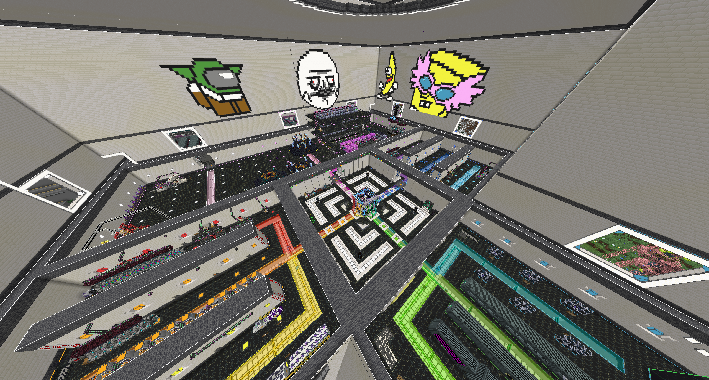
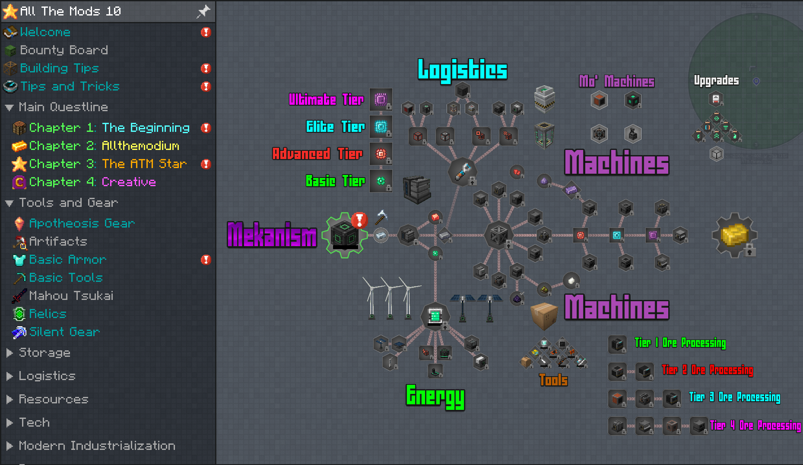
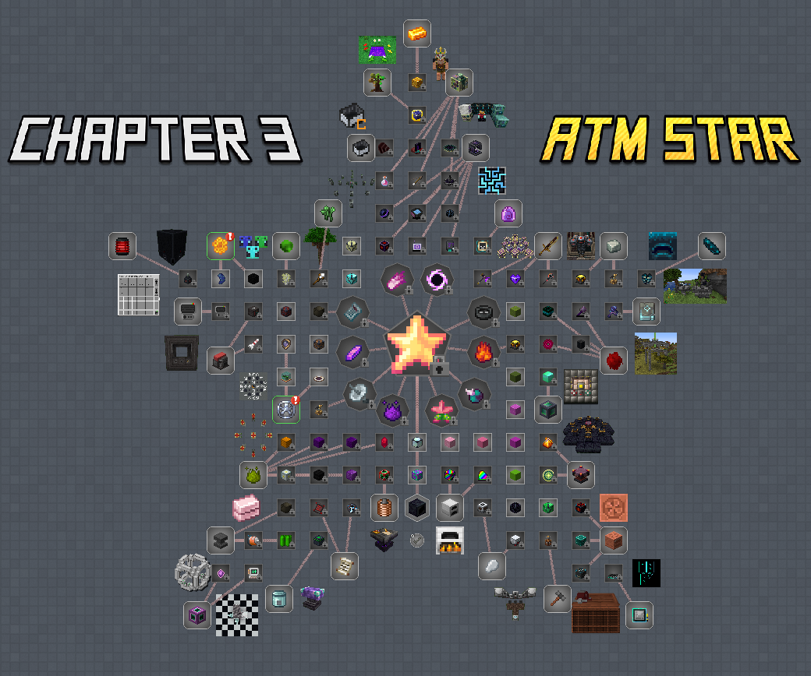
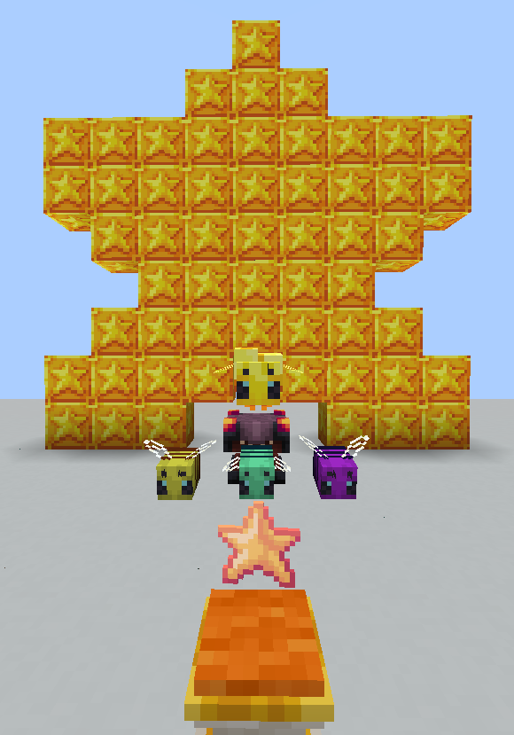
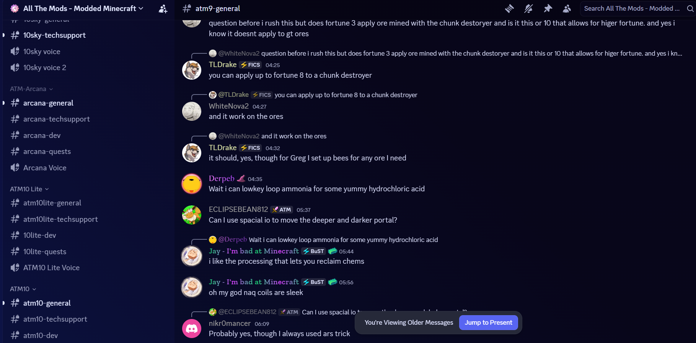
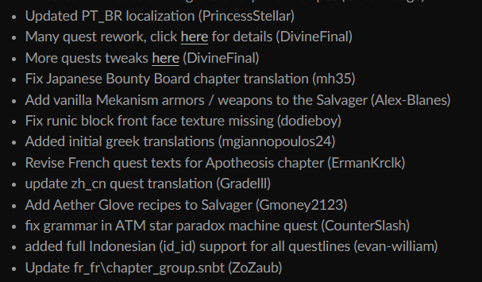
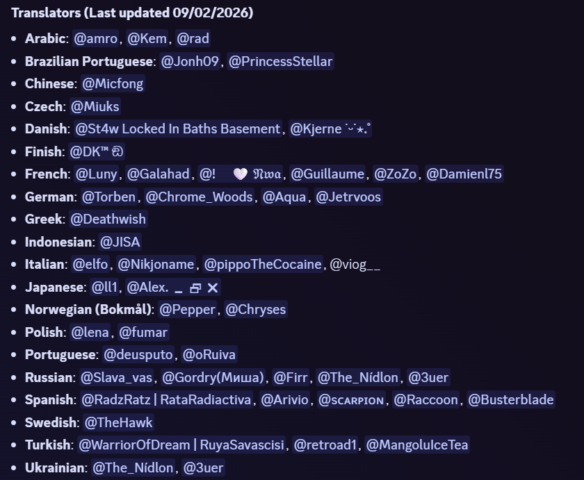

# Why AllTheMods Modpacks Are So Popular

Have you ever found yourself staring blankly at a Modpack list at 2 AM, just scrolling? 

You probably know what I'm talking about. You want to play something, but don't want a sweaty and stressful expert pack where a crafting table is mid-game, nor do you want a Kitchen Sink pack where you will just find yourself running around, doing the same as always, without an objective.

Well, lucky for you, today I'm going to introduce the **AllTheMods** Modpack series, and how they have the best of both worlds. For simplification, I'm going to use **ATM** as the short name for AllTheMods.

> *Fun Fact: The name "Kitchen Sink" for a category of Modpacks comes from the phrase "everything but the kitchen sink," which is just that: everything you can imagine is probably there.*

## What *Is* "AllTheMods"?

To kick things off, I'm going to start with a quote by the founder of ATM, WhatTheDrunk (aka WTD):

> "All the Mods started out as a private pack for just a few friends of mine that turned into something others wanted to play! It has all the basics that most other 'big name' packs include but with a nice mix of some of newer or lesser-known mods as well."

As he described it, the point of AllTheMods packs is to be something fun to play, with an even mix of known and lesser-known mods, keeping the familiar smell of the regular mods, but with new mods for you to play with and explore (also helping new mod authors).

## What Makes ATM Different From Other Packs?

Well, to start off, it isn't just a "download 400 mods and launch" type of pack; there is testing and optimization behind it, along with a lot of tweaks. 

What tweaks, you may ask? I'll tell you some:

* **Fixing recipes that break with other mods:** Some mods end up using the same recipe or break them some other way, which ends up causing a headache for players.
* **Integrating mods with each other:** Making the same item work between mods, using the same machine for multiple mods, or even creating alternative recipes for items via other mods.
* **Uniformity and Unification of resources:** No multiple recipes with different costs to make the same item, and not finding 5 different copper ores when mining.
* **Balance changes:** Making it so there isn't a "one mod to rule them all," allowing you to choose whichever way you want to do something without being left behind by other players using something better.
* **Quality of Life (QOL):** Custom recipes to make your life easier, like alternative ways to get hard-to-find items, or making non-renewable items actually automatable.
* **World Generation:** Fixing structure placement so you don't find structures inside each other, and making mods work with biome mods so you aren't forced to look for vanilla biomes for certain items or mobs.

I could go on and on, but I think you get the point. But it's not just tweaks that ATM does... Quests! What's a Modpack without them, right?

## Quests: A Guide, Not a Rulebook

The main difference between normal quests and ATM quests is that in ATM, they aren't forcing you through a specific path; they are there just to teach you how a mod works and all it has to offer. Quests are always welcome, either for new players experiencing mods for the first time, or veterans needing a refresh on how to do something.

ATM prioritizes simplicity, striving to keep it functional so any player can open the quests without getting a headache. 

Not only that, but quests aren't just TO-DO lists; they actually reward you for completing them, sometimes giving you powerful items or blocks that can propel your progression a lot. And with the sheer amount of quests, sometimes when you start a mod, you already have some of the resources needed to progress in it, saving you time and energy.

## The "Star" of the Show: A Mastery Achievement

If you have ever seen anything about ATM Modpacks, you probably noticed there is a special item that shows up everywhere... The **ATM Star**. This is the item that defines a big chunk of the pack.

If there was a way to get Creative mode in survival, this would be the closest to it. Not because the Star is *that* powerful (although it does unlock Creative items), but because to reach it, you *will* have to have everything in the pack. By the time you get the Star, you unknowingly reached near-creative mode. 

* You will have to become an engineer to master automation, resource production, and make sure you don't blow yourself up or your base up while you do it.
* Dive deep into magic and become a wizard (and try to not blow yourself up while doing that, too).
* Explore over a hundred structures, discover new biomes, and get to know over a dozen dimensions. Some can be used for your benefit, while others will make you suffer as you annihilate everything in them. But hey, cool weapons and armor!

You could say that getting an **ATM Star** is the same as saying you "beat" the pack, that you know how all the mods work (get it... AllTheMods?), and that you, well, did it... or did you?

You probably didn't notice, but I said "*an* ATM Star." Well, that's because there is a secondary objective, which is to make **18** of them.

Why? There is a very cute and plump thing waiting for you called the **Starry Bee**. If you know how bee mods work, you can probably see where this is going.

That's right, you can create a bee to make ATM Stars, which can be made for the low price of 9 ATM Stars plus 9 more for it to pollinate on.

This is the ultimate objective of the pack, but you choose: Are you more laid back and prefer to get one and call it a day, or will you master the beautiful thing that is automation, and possibly learn about even *more* mods?

Well, whichever you choose, the actual objective of the pack is (wait for it)... **have fun**. Yup, that's what actually started AllTheMods. Having fun IS the main objective; you don't need to be the best, or the fastest, or whatever. All that matters is that you have fun and learn many things while doing it.

Now that you understand what AllTheMods actually is, I'm going to show you how it became so popular.

## The Community: A Perpetual Motion Machine

You wouldn't think that a Modpack made for friends would go too far. Well, neither did WTD when he published the first AllTheMods pack. 

Surprisingly enough, it took the modded MC community by storm! While searching for what players said at the time, I found comments about *All The Mods Expert: Remastered* like:

> "What the drunk?! This has everything I've been looking for in a pack."

> "Just played through the first page of the quest book - it's really polished and well put together, having a blast! Thank you!"

> "...I've been looking forward to this since I found the beta playthrough that ChosenArchitect has been doing."

Hold on, notice how someone talked about ChosenArchitect? For those who don't know, ChosenArchitect is one of the most popular modded MC content creators nowadays. 

This shows how content creators were a big part of what made ATM get so popular. Players would watch a beta gameplay of a pack and would instantly feel the urge to play it. Aside from progression-based packs, there really weren't many options for a polished kitchen sink experience, and that's what made ATM unique.

## Discord: Where Everyone Comes Together

Discord is the house where ATM and the community live; it's where all the magic happens.

With channels for everything, ranging from Gameplay Discussion and Tech Support per pack to Showoff and Self-Promo, there are spaces for pretty much everything needed. In those channels lie possibly millions of messages since the start of AllTheMods, including hundreds of guides made by players and devs alike.

With the growth of the community, there is more happening than just chatter; there are players who actually want to contribute to the packs!

## Contributions: By The Players, For The Players

Ever seen something broken in a Modpack, or felt like there is something missing? That's how many contributors or even actual ATM developers came to be: they wanted to fix something broken, so they just fixed it, and WTD would push it in the next update.

This is one of the examples of such contributions. Some are small, some are big, but all are welcome.

Remember me talking about quests? Well, a lot of them are made by players who want to help new players starting the mod thrive in it. They enjoyed a mod so much that they ended up making a whole guide on it.

ATM won't leave them by themselves, though; they will grant these players a seat in the Quest Development channels so they get the help they need, or even express their opinions about other quests being designed. This is how the quests end up sounding so natural; it's a collaboration between the players and the devs, both working as one!

## Translations: Making the Modpack Accessible to Anyone

With Minecraft being such a global sensation, and everything being in English, a lot of players wouldn't ever get to experience Modpacks like everyone else who speaks it.

Knowing that, ATM pushed to create their own Translation Department, where players from all over the world can make translations for the quests in the Modpacks. And even in the current days when AI is all the talk, they will not let it ruin the beauty that is the questing system.

To facilitate and motivate translations, they have a specific area within the Discord server where they offer extensive guides and direct support to translators, so players can focus solely on translating and let ATM handle the complicated stuff.

As a small show of gratitude, they give out a unique role within the Discord server and mention translators in-game plus in changelogs, effectively immortalizing them in ATM's legacy.

## Collaboration with Mod Devs: Highway of Bug Fixes

With the quantity of mods always increasing and new mods popping up, bugs are inevitable. With that, ATM since its early days has pushed to get as many mod devs on board their Discord as possible, uniting hundreds of fellow devs in one place. 

The sheer amount of diversity, experience, and knowledge present in one place makes *everything* move faster and more efficiently. Bugs being squashed, things being optimized, and new features being tested extensively before heading to the players ensure everything goes smoothly.

It's this level of collaboration that ATM strives to achieve, which ends up not only impacting ATM packs but the modded community as a whole.

## Wrapping Up

All this is to say that ATM didn't just spawn at the top of the charts. The team worked their way through challenges, collaborated directly with the community, and constantly strived to make Modpacks genuinely fun to play.

Speaking of fun, did you know the ATM team takes special care to optimize their packs for both servers and players alike? Because of this dedication, you don't actually need a NASA computer to run 400+ mods, which makes hosting a server for your friends incredibly easy.

If this inspired you to go play an ATM Modpack (or any Modpack, for that matter), maybe invite some friends over! If you want a server host that will handle any Modpack with no lag or hassle, look no further than **Akliz**. They have been doing this for over a decade. Since they are players themselves, they know exactly what's up and won't just tell you to go talk to the mod developers. They will actually get their hands dirty to fix your problem, be it a simple config error or full-blown chunk corruption. They also happen to have direct contact with the ATM development team, meaning they can resolve your issues faster than any other host you might find. [Start your **Akliz** server today.](https://www.akliz.net/pricing)

**Anyway, this is what's keeping me causing nuclear fallouts in 2026. See you around in the modded dimension!**